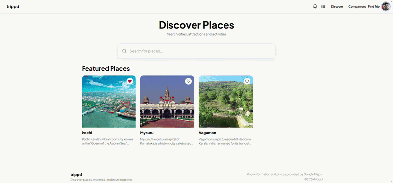
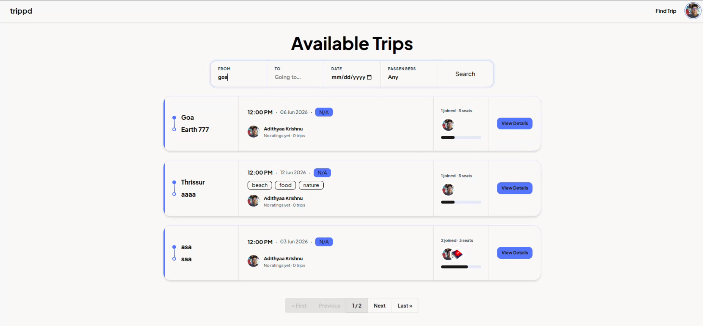
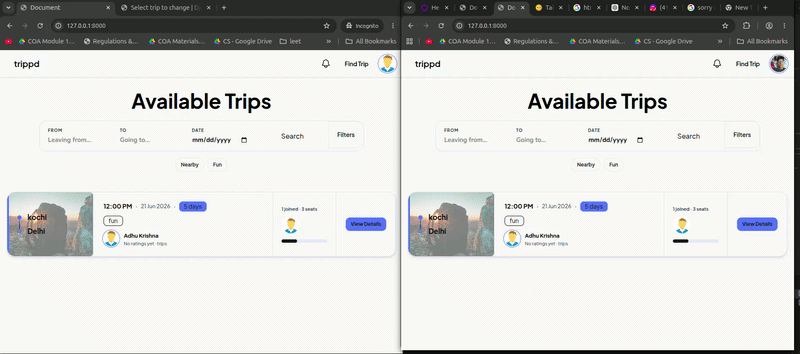

# Trippd

Trippd is a travel companion and a place discovering platform where the user can find different tourist spots and create or join trip groups of their choice.
The idea behind the project was to find a way to connect likeminded people thinking of going to the same place
> This project is still under development

## Preview

### Discover Places



### Trip List



### Joining a Trip



## Features

- User Authentication and Profile Management
- Discover Places to Visit and Nearby Attractions and Save Them
- Create and Manage Trips
- Join Trip Groups and Interact with Other Users
- Realtime Notifications, Group Messaging and Direct Messaging
- Find Travel Companions looking for going to a similar destination
- Ask AI to know about Destination specific data like weather, best time to vist etc

### Installation

```bash

git clone https://github.com/ZLaTaN003/trippd.git
cd trippd

#create venv need uv installed
uv sync

uv run python manage.py migrate

uv run python manage.py runserver
```
